# PANDEMICA

**Computational epidemiology and outbreak modelling platform in Python.**

PANDEMICA models how an infectious disease spreads using four approaches: deterministic
(ODEs), stochastic (Gillespie), network (agent-based) and spatial (metapopulation). It fits
the models to real public surveillance data and checks them against known analytical
results. An interactive Streamlit dashboard lets you change every key parameter live.

> **Educational project.** These are simplified textbook models. They are not forecasting
> tools and make no public-health, clinical or policy claims. See [Limitations](#limitations).

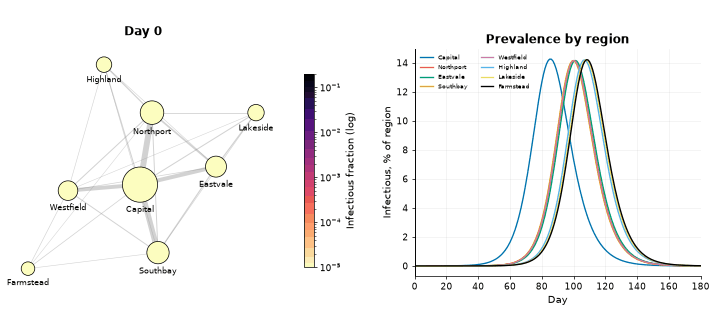

## Headline results
Every number below is generated from the saved runs in [`results/`](results/) by
`analysis/report.py`.

<!-- HEADLINES:START -->
- **Real-data fit:** 1978 boarding-school influenza outbreak, R0 = 3.93 (95% bootstrap CI 3.41 - 4.60), infectious period 2.0 days.
- **Calibrated uncertainty:** on synthetic data with known truth, the 95% CI for R0 covered the true value in 95% of 20 datasets.
- **Stochastic vs theory:** simulated early-extinction probability 0.17 vs branching-process theory 0.16.
- **Network structure:** vaccinating the 10% best-connected nodes of a scale-free network cut the attack rate to 2.8%, vs 58.8% for random vaccination.
- **Interventions:** a 60-day lockdown alone averted 0.5% of deaths (it mostly delays the wave); combined with vaccination and isolation, 99.6%. Cutting travel by 90% delayed regional arrival by 13.6 days on average.
<!-- HEADLINES:END -->

## What is inside

| Module | Question it answers | Method | Code |
|---|---|---|---|
| **M1** Compartmental | How does an epidemic unfold in a well-mixed population? | SIR / SEIR / SEIRD ODEs with `solve_ivp`, optional vaccination, waning immunity, isolation | [`src/compartmental.py`](src/compartmental.py) |
| **M2** Fitting | What R0 do real outbreak data imply, and how sure are we? | Least squares on square-root counts, residual bootstrap CIs, parameter-recovery and CI-coverage checks | [`src/fitting.py`](src/fitting.py) |
| **M3** Stochastic | What does chance do when case numbers are small? | Exact Gillespie simulation, extinction probability vs branching theory | [`src/stochastic.py`](src/stochastic.py) |
| **M4** Network | How does who-contacts-whom change the epidemic? | Erdos-Renyi, Watts-Strogatz and Barabasi-Albert networks (NetworkX), superspreaders, targeted vaccination | [`src/network.py`](src/network.py) |
| **M5** Interventions | When and how hard should we intervene? | Lockdown / vaccination / test-and-isolate counterfactuals, start-day x strength heatmaps | [`src/interventions.py`](src/interventions.py) |
| **M6** Sensitivity | Which parameters matter most? | Latin hypercube sampling + partial rank correlation (PRCC), tornado plot | [`src/sensitivity.py`](src/sensitivity.py) |
| **M7** Spatial | How does an epidemic travel between regions? | 8-region metapopulation SEIR with a gravity-model travel matrix, animated map | [`src/metapopulation.py`](src/metapopulation.py) |

The equations for every model are written out in [METHODS.md](METHODS.md).

## Dashboard

```bash
streamlit run app.py
```

One tab per module with live sliders. `?tab=m1` ... `?tab=m7` in the URL opens a single module.

| M1 - compartmental models | M5 - intervention simulator |
|---|---|
| 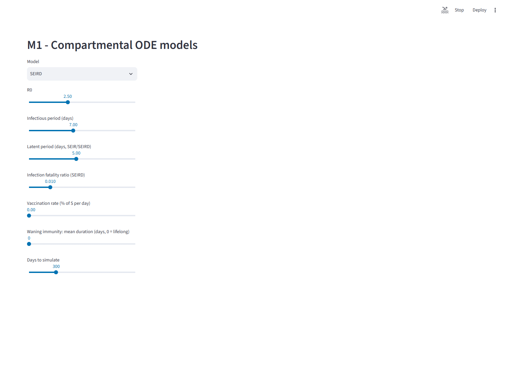 | 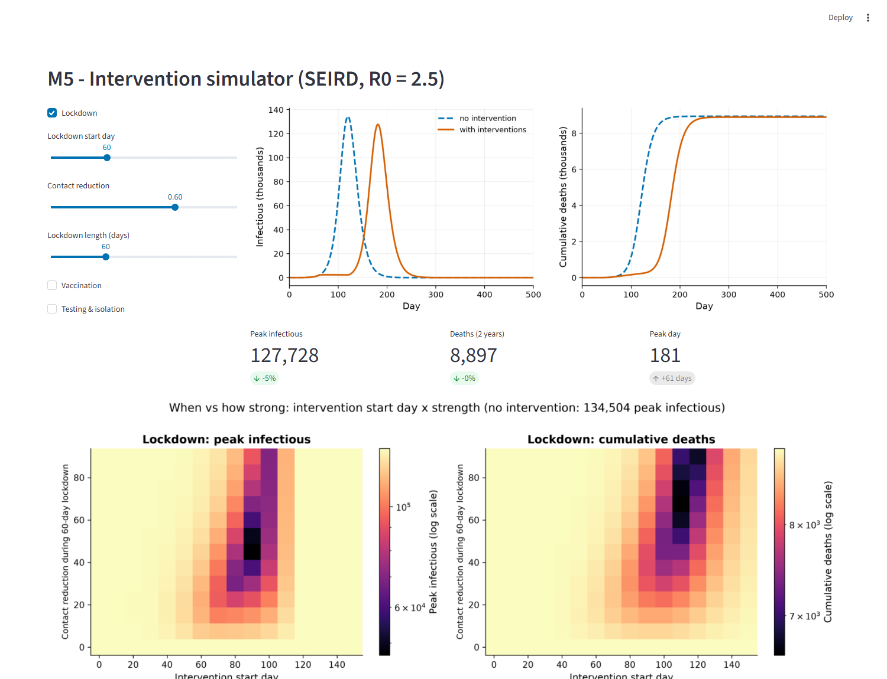 |
| **M3 - stochastic replicates** | **M4 - network epidemics** |
| 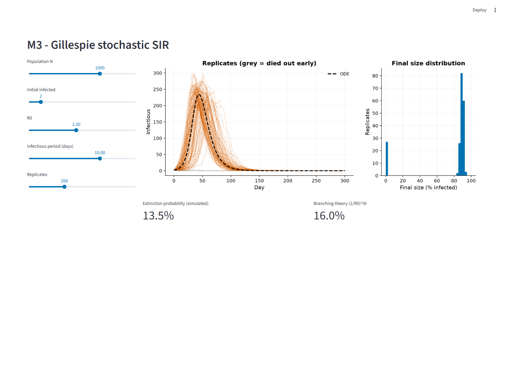 | 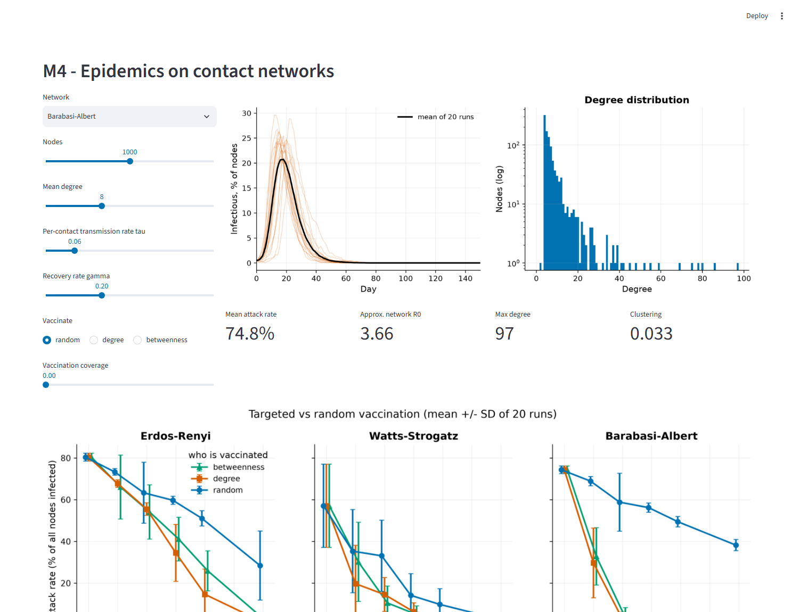 |

## Quick start

Tested on Python 3.14 (Windows 11, CPU only, no GPU needed). The pinned versions in
`requirements.txt` were only tested on 3.14. From the project folder:

```bash
python -m venv .venv
# Windows:  .venv\Scripts\activate      macOS/Linux:  source .venv/bin/activate
pip install -r requirements.txt

pytest                  # full test suite, including the analytical validation tests (~1 min)
python run_all.py       # regenerate every result and figure (~10 min on a laptop CPU)
streamlit run app.py    # open the dashboard
```

`python run_all.py m3 m5` reruns only some steps. The data is cached in `data/`, so after
the first run everything works offline. If a download fails, the project falls back to a
clearly labelled synthetic dataset and keeps going. Seeds are fixed, so a rerun in a fresh
environment reproduces `results/` exactly.

On Windows, keep the project in a short path (for example `C:\projects\pandemica`):
Streamlit's install contains deeply nested files that can exceed the 260-character path limit.

## Figures

A selection (all 300 dpi; captions for every figure are in [figures/CAPTIONS.md](figures/CAPTIONS.md)):

| | |
|---|---|
| 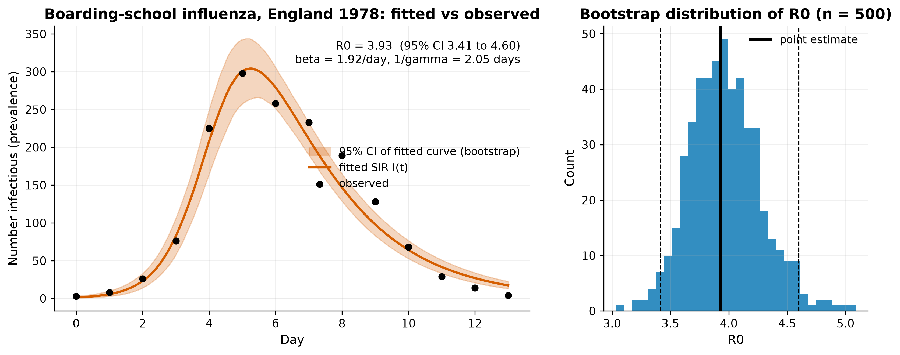 SIR fitted to the 1978 boarding-school flu outbreak, with a 95% bootstrap band and the bootstrap distribution of R0. | 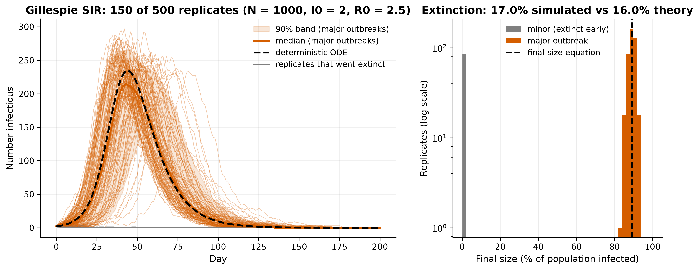 Gillespie replicates vs the ODE curve; some outbreaks die out by chance. |
| 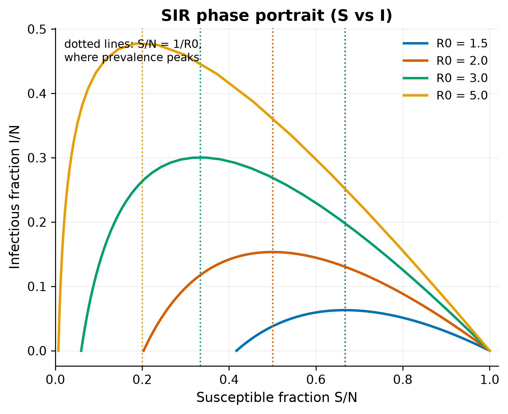 SIR phase portrait: prevalence peaks where S/N = 1/R0. | 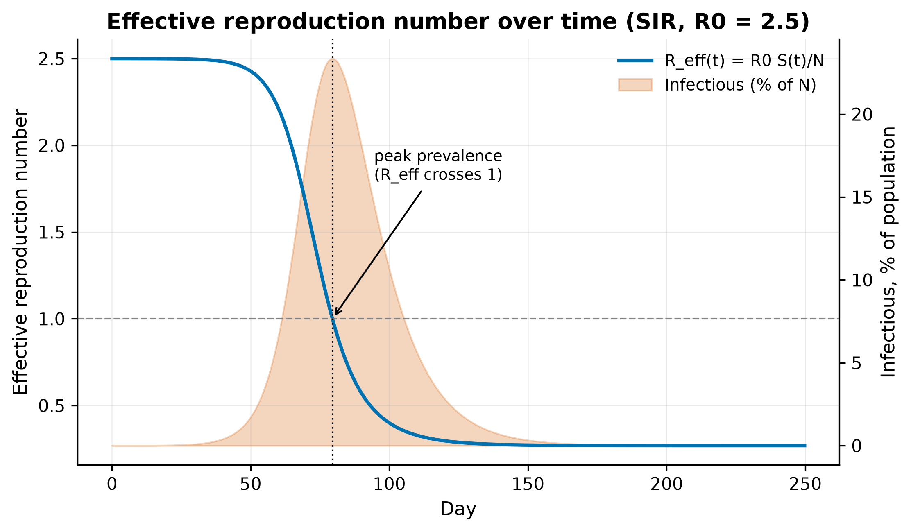 R_eff(t) crosses 1 exactly at the epidemic peak. |
| 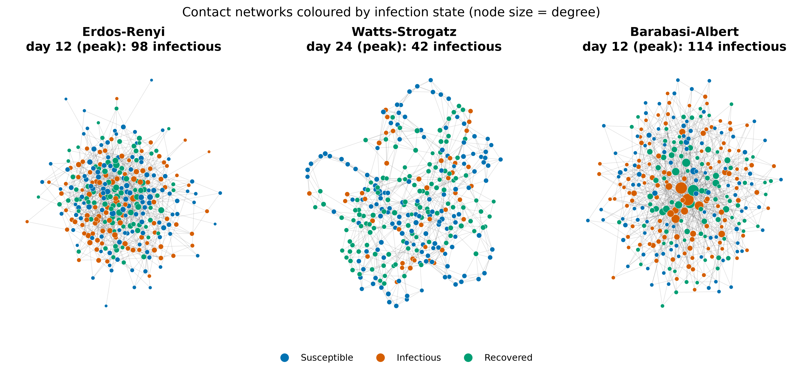 Three network types coloured by infection state. | 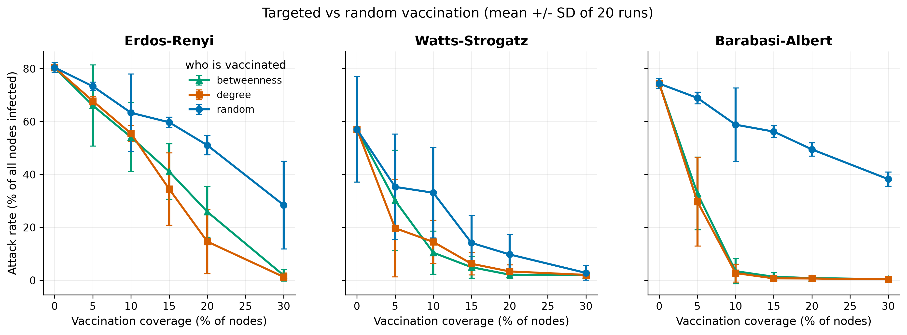 Targeted vs random vaccination on each network. |
| 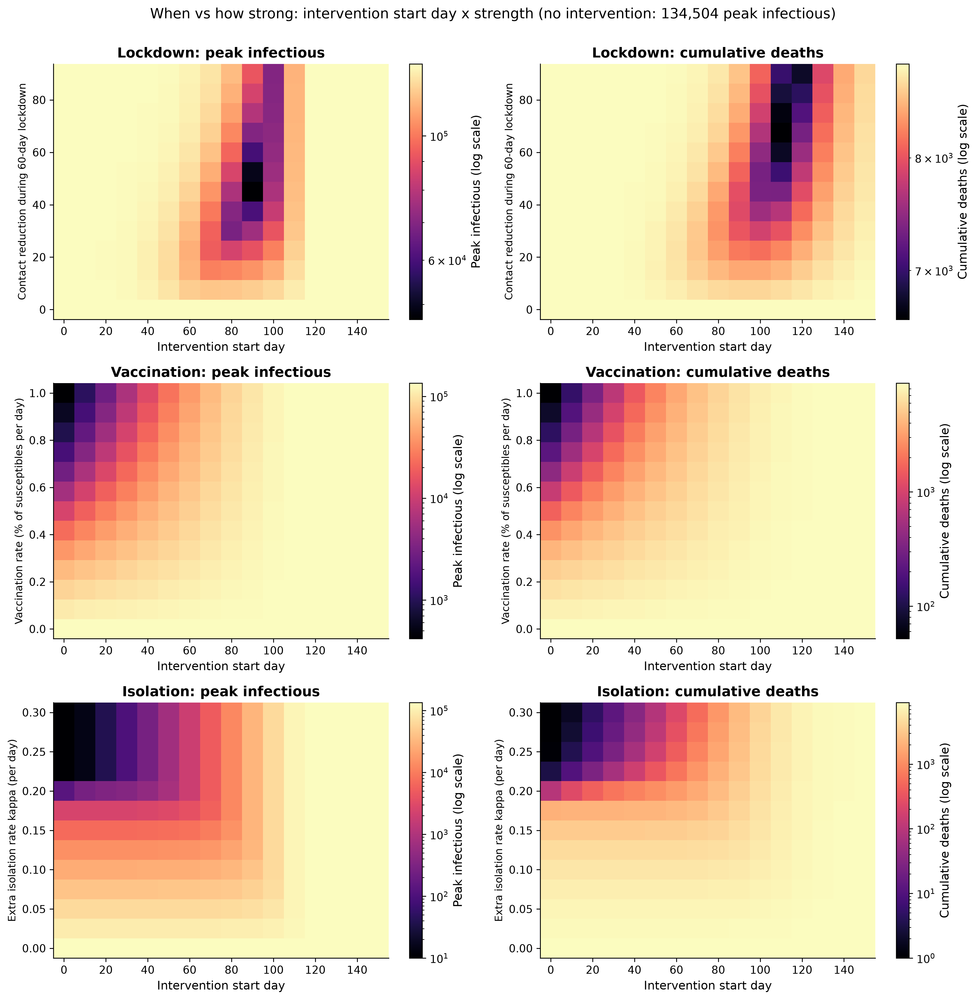 Intervention start day x strength vs peak infections and deaths. | 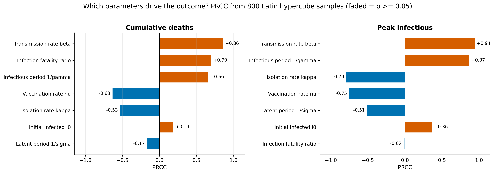 PRCC tornado plot: what drives deaths and peak size. |

## Results
<!-- RESULTS:START -->
### M1 - Validation against analytical results
| Check | Result |
|---|---|
| Max relative population-conservation error | 4.2e-15 |
| Max error vs final-size equation (attack fraction, R0 = 1.5-4) | 2.9e-11 |
| Max error vs analytical SIR peak prevalence | 1.5e-06 |

### M2 - Fit to real data: Boarding-school influenza, England 1978
| Quantity | Estimate | 95% bootstrap CI |
|---|---|---|
| R0 | **3.93** | 3.41 - 4.60 |
| beta (per day) | 1.92 | 1.70 - 2.16 |
| gamma (per day) | 0.488 | 0.442 - 0.533 |
| Infectious period 1/gamma (days) | 2.05 | 1.87 - 2.26 |

(500 bootstrap refits; RMSE 18.2 cases.)

**Parameter recovery on SYNTHETIC data** (known truth):

| Parameter | True | Estimate | 95% CI | Error | True inside CI |
|---|---|---|---|---|---|
| beta | 1.600 | 1.564 | 1.522 - 1.606 | -2.2% | yes |
| gamma | 0.450 | 0.451 | 0.442 - 0.462 | +0.3% | yes |
| I0 | 2.000 | 2.656 | 2.163 - 3.220 | +32.8% | no |
| R0 | 3.556 | 3.466 | 3.344 - 3.571 | -2.5% | yes |

**CI calibration:** over 20 synthetic datasets, the 95% CI for R0 contained the true value 95% of the time; mean estimate 3.547 vs true 3.556. The same check with least squares on raw counts gave 80% coverage, which is why the square-root scale is used (a small study: 20 datasets, 50 refits each).

**COVID-19 early growth (JHU CSSE)**: method demonstration only; assumes a 5.2-day latent and 5.0-day infectious period.

| Country | Window start | Growth rate r (/day) | Doubling time (days) | Implied R0 (95% CI) |
|---|---|---|---|---|
| US | 2020-03-02 | 0.287 | 2.4 | 6.1 (5.8 - 6.4) |
| United Kingdom | 2020-02-29 | 0.239 | 2.9 | 4.9 (4.5 - 5.3) |
| Italy | 2020-02-20 | 0.258 | 2.7 | 5.4 (4.9 - 5.8) |
| Germany | 2020-02-29 | 0.241 | 2.9 | 5.0 (4.6 - 5.4) |
| Korea, South | 2020-02-18 | 0.230 | 3.0 | 4.7 (4.0 - 5.4) |
| India | 2020-03-17 | 0.152 | 4.6 | 3.1 (2.8 - 3.5) |

### M3 - Gillespie stochastic SIR (N = 1000, I0 = 2, R0 = 2.5, 500 replicates)
| Quantity | Simulated | Theory / ODE |
|---|---|---|
| Early extinction probability | 0.170 | 0.160 ((1/R0)^I0) |
| Attack rate of major outbreaks | 0.891 | 0.893 (final-size equation) |
| Peak infectious, major outbreaks: median (5-95%) | 244 (200 - 282) | 234 (ODE) |

Across 15 (R0, I0) combinations the largest gap between simulated and theoretical extinction probability was 0.048. The gap between the stochastic mean and the ODE shrinks with population size with log-log slope -0.87.

### M4 - Network epidemics (2000 nodes, mean degree 8, 50 runs each)
| Network | Max degree | Clustering | Approx. R0 | Attack rate | Peak prevalence | Peak day |
|---|---|---|---|---|---|---|
| Erdos-Renyi | 19 | 0.003 | 1.83 | 80.2% | 19.4% | 29 |
| Watts-Strogatz | 12 | 0.471 | 1.64 | 59.9% | 5.8% | 64 |
| Barabasi-Albert | 137 | 0.021 | 4.11 | 73.3% | 23.8% | 17 |

Attack rate with 10% of nodes vaccinated:

| Network | random (10% vaccinated) | degree (10% vaccinated) | betweenness (10% vaccinated) |
|---|---|---|---|
| Barabasi-Albert | 58.8% | 2.8% | 3.5% |
| Erdos-Renyi | 63.3% | 55.5% | 54.1% |
| Watts-Strogatz | 33.1% | 14.5% | 10.5% |

On the Barabasi-Albert network the top 1% of nodes by degree caused 18% of all infections (Spearman correlation of secondary infections with degree 0.92, with betweenness 0.78).

### M5 - Interventions (SEIRD, R0 = 2.5, N = 1,000,000, 2-year horizon)
| Scenario | Peak infectious | Peak day | Deaths | Deaths averted |
|---|---|---|---|---|
| No intervention | 134,504 | 120 | 8,941 | 0.0% |
| Lockdown day 60, 60% for 60 d | 127,728 | 181 | 8,897 | 0.5% |
| Vaccination from day 60, 0.5%/day | 76,442 | 121 | 5,967 | 33.3% |
| Test & isolate from day 30, 0.1/day | 26,215 | 182 | 5,662 | 36.7% |
| All three combined | 388 | 62 | 38 | 99.6% |

Best single 60-day lockdown in the sweep (fewest deaths): start day 110, contact reduction 68%, 6,605 deaths. A temporary lockdown mainly delays the wave; it helps most when timed near the peak.

### M6 - Sensitivity (800 Latin hypercube samples): top 4 drivers
| Outcome | Parameter | PRCC |
|---|---|---|
| cumulative deaths | beta | +0.86 |
| cumulative deaths | ifr | +0.70 |
| cumulative deaths | infectious_period | +0.66 |
| cumulative deaths | vaccination_rate | -0.63 |
| peak infectious | beta | +0.94 |
| peak infectious | infectious_period | +0.87 |
| peak infectious | isolation_rate | -0.79 |
| peak infectious | vaccination_rate | -0.75 |

### M7 - Spatial spread (8 regions, 5,300,000 people)
| Region | Population | Arrival day (baseline) | Arrival day (travel -90%) | Attack rate |
|---|---|---|---|---|
| Capital | 2,000,000 | 25 | 25 | 88.9% |
| Northport | 800,000 | 44 | 58 | 89.0% |
| Eastvale | 600,000 | 45 | 58 | 89.1% |
| Southbay | 700,000 | 44 | 57 | 89.0% |
| Westfield | 500,000 | 44 | 57 | 89.0% |
| Highland | 250,000 | 50 | 64 | 89.1% |
| Lakeside | 300,000 | 51 | 65 | 89.1% |
| Farmstead | 150,000 | 52 | 66 | 89.1% |

Cutting travel by 90% delayed arrival outside the Capital by 13.6 days on average, but the overall attack rate stayed at 89.2% (vs 89.0%).

<!-- RESULTS:END -->

## How each module works (short version)

**M1 - Compartmental models.** People move between compartments (Susceptible, Exposed,
Infectious, Recovered, Dead, Vaccinated) at rates set by the parameters. One general
right-hand side covers SIR, SEIR and SEIRD, so all three share the same tested logic.
`beta`, the vaccination rate and the isolation rate can vary over time, which is how M5
expresses interventions.

**M2 - Fitting.** Minimise the squared difference between the square roots of the model
curve and the data (the square root makes count noise equally sized, which least squares
assumes). Uncertainty comes from a residual bootstrap: resample the residuals, rebuild
pseudo-datasets, refit, and take percentiles. The same pipeline is run on synthetic data with
known parameters to show that it recovers them and that its 95% intervals really cover 95%.

**M3 - Stochastic.** The Gillespie algorithm draws the time to the next event from an
exponential distribution and picks infection or recovery in proportion to their rates. It
simulates the exact Markov chain behind the SIR ODE. Small outbreaks can die out by chance,
which the ODE cannot show.

**M4 - Network.** Each person is a node; infection only travels along edges. With the same
mean number of contacts, networks with hubs (scale-free) spread faster, and clustered
networks (small-world) spread slower. Removing the hubs first is far more effective than
vaccinating at random.

**M5 - Interventions.** The SEIRD model re-run with time-varying contact, vaccination and
isolation rates. The heatmaps sweep when an intervention starts against how strong it is.

**M6 - Sensitivity.** Sample all uncertain parameters at once with a Latin hypercube, run
the model for each sample, and rank parameters by partial rank correlation with each
outcome.

**M7 - Spatial.** Eight regions, each with its own SEIR epidemic, linked by a travel matrix.
The epidemic arrives in far-away regions later, and travel restrictions delay but do not
prevent it.

## Validation

The test suite (`pytest`) checks the models against results that are known independently
of the code:

- total population is conserved by every model, to floating-point precision;
- simulated final epidemic size matches the final-size equation ln(s0/s_inf) = R0 (1 - s_inf);
- no epidemic occurs when R0 < 1 (ODE, stochastic, and isolation above the threshold);
- SIR peak prevalence and the S = N/R0 peak condition match closed-form results;
- the stochastic ensemble mean approaches the ODE as population size grows;
- the simulated extinction probability matches (1/R0)^I0;
- the fitting code recovers known parameters from synthetic data;
- PRCC detects known monotone effects and ignores irrelevant inputs;
- the dashboard renders every tab without errors (Streamlit `AppTest`).

## Data

| Dataset | Use | Source |
|---|---|---|
| 1978 English boarding-school influenza outbreak (N = 763) | M2 fit | BMJ 1978, via the RECON `outbreaks` R package on GitHub |
| JHU CSSE COVID-19 time series | exploratory plots, early-growth R0 demo | [CSSEGISandData/COVID-19](https://github.com/CSSEGISandData/COVID-19) (CC BY 4.0) |
| Synthetic SIR outbreak (**SYNTHETIC**) | parameter-recovery validation, offline fallback | generated by `src/data.py` with a fixed seed |

Details in [data/SOURCES.md](data/SOURCES.md).

## Limitations

- **These are simplified educational models, not forecasting tools.** Nothing here should
  inform public-health, clinical or policy decisions.
- Populations are homogeneous within each compartment, network or region: no age
  structure, households, schools or workplaces.
- Parameters are constant apart from the explicit interventions: no seasonality, behaviour
  change, new variants or changes in testing.
- The flu fit treats "confined to bed" as the infectious prevalence and assumes a closed
  population with perfect reporting.
- COVID-19 R0 values from early growth rates depend strongly on the assumed latent and
  infectious periods and on early testing growth; they only demonstrate the method.
- Vaccines are perfect and all-or-nothing; isolation removes people instantly.
- Networks are synthetic (random graph models), not measured contact data, and are static.
- The spatial model uses a fictional map, a gravity model for travel, and a deterministic
  ODE (which puts a tiny fraction of an infected person in every region at once).
- The intervention scenarios, parameter ranges and costs of interventions are illustrative.
  The models do not weigh the social or economic costs of any intervention.

## Project structure

```
src/            model code, one module per M1-M7 (+ data layer, plot style)
analysis/       one script per module: writes results/ and figures/
dashboard/      Streamlit tab code (app.py is the entry point)
tests/          pytest suite (validation + unit + dashboard smoke tests)
data/           cached raw data and the synthetic dataset
results/        every number, as CSV/JSON (+ SUMMARY.md)
figures/        every figure (PNG 300 dpi, GIF, MP4) + CAPTIONS.md
run_all.py      reproduces everything from scratch
METHODS.md      equations for every model
DECISIONS.md    design decisions and why
```

## Further reading in this repo

- [METHODS.md](METHODS.md): the maths.
- [DECISIONS.md](DECISIONS.md): every judgment call.
- [INTERVIEW_PREP.md](INTERVIEW_PREP.md): likely questions with answers.
- [PROGRESS.md](PROGRESS.md): development log and handoff notes.
